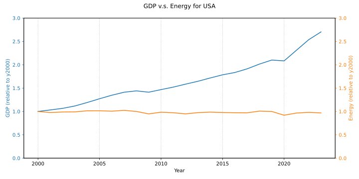
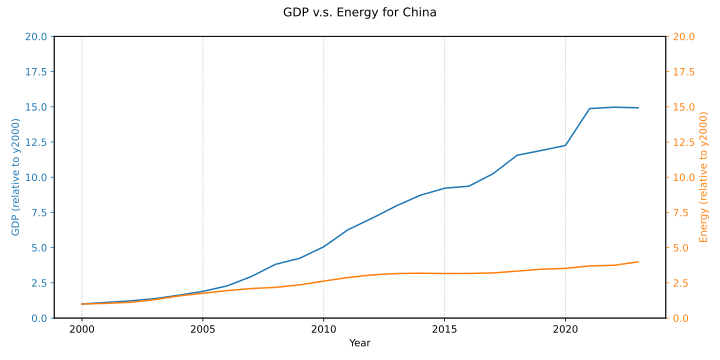

# energy-stats

Gather and analyze energy and finacial statistics. Statistics is
collected from:

* [U.S Energy Information Adminisration (EIA)](https://www.eia.gov/)
* [Our World In Data (OWID)](https://ourworldindata.org/)
* [World Bank](https://data.worldbank.org/indicator/NY.GDP.MKTP.CD)

EIA and OWID provides APIs to select and download data. Stats used for
graphs is stored locally in [data/](data/).

## Energy Consumption v.s GDP

GDP is used to measure progress (growth), but really measure financial
transactions. As a metric of progress, as in "people get's it better",
GDP is a poor choice. A better metric would be "activity", and since
no activity is possible without energy, energy consumption is a good
proxy.

Below are graphs for relative GDP and Energy Consumption since year
2000 for USA and China:

